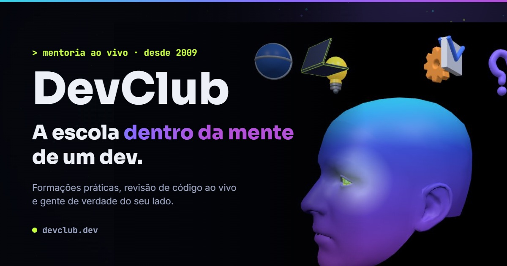

# DevClub — a escola dentro da mente de um dev

> Página conceito criada para o concurso da vaga Full Stack do DevClub.
> A ideia: em vez de *falar* sobre a escola, colocar o visitante **dentro da
> mente de quem aprende a programar** — e deixar a página provar, na prática,
> o que a escola ensina.



## O conceito

A visita começa com uma intro 3D: **16 mil partículas** se organizam numa
cabeça humana, ideias orbitam ao redor (laptop, lâmpada, engrenagem…), um dos
olhos acende com o reflexo da própria página — e a câmera mergulha pelo olho
para dentro da mente. Todo o resto do site acontece "lá dentro": o fundo de
partículas continua o mesmo universo da intro.

## Destaques

| Seção | O que tem de vivo |
|---|---|
| Intro 3D | cabeça de partículas com Three.js, olho-tela, mergulho de câmera |
| Plataforma | editor com abas que digita código sozinho, terminal e preview |
| Mentorias | sala de vídeochamada com 4 vídeos em loop e botões funcionais (sair, mudo, câmera, ampliar, pausar) |
| História | linha do tempo 2009→hoje com imagem fixa que troca conforme o scroll |
| Formações | deck navegável; a de Cibersegurança é um **scanner interativo** que mostra ao visitante os dados que o navegador entrega (e o que fica protegido) |
| Faixa de trilhas | 15 formações/trilhas em esteira contínua |
| Além do código | recrutadora, terapeuta, agentes de IA, suporte 7 dias |
| Alunos | leque de depoimentos com física de cartas (porte de um componente React para JS puro + GSAP) |
| Projetos | deck arrastável com autoplay e molduras de navegador |
| Empresas | muro de logos em dois sentidos, com contraste calculado por marca |
| Tutores | trilho arrastável; clicar no card revela a bio |
| Diploma | certificado desenhado 100% em CSS, com tilt 3D |
| Tema | claro/escuro com um interruptor discreto; as "telas" continuam escuras nos dois temas, como ferramentas de dev de verdade |

## Stack

- **HTML + CSS + JavaScript puros** — sem framework, sem build, sem dependência para instalar
- [Three.js](https://threejs.org/) (via CDN) na intro 3D
- [GSAP](https://gsap.com/) (via CDN) no leque de depoimentos
- Fontes self-hosted (Sora, Inter, JetBrains Mono)

## Rodando localmente

Qualquer servidor estático serve:

```bash
python -m http.server 4173
```

Depois abra `http://localhost:4173`. Atalho útil: `?nointro` pula a intro 3D.

## Estrutura

```
index.html          página única
css/                v2.css (base) · intro-head.css · polish.css · theme.css
js/                 intro-head.js (3D) · v2.js (interações) · fan.js · scanner.js · theme.js
assets/             fontes, logos SVG, vídeos, imagens e ícones 3D
```

## Acessibilidade e performance

- Contraste **WCAG AA** verificado por medição nos dois temas (inclusive por marca no muro de logos)
- `prefers-reduced-motion` respeitado: intro, esteiras e vídeos viram versões estáticas
- Vídeos da sala de mentoria recomprimidos de 35,5 MB para **1,4 MB** (H.264 + faststart), com play/pause automático conforme a visibilidade
- Navegação por teclado nos carrosséis e botões com `aria-label`/`aria-pressed`

## Transparência

Esta é uma **página conceito**: números, história, depoimentos e tutores são
ilustrativos; os retratos e vídeos foram gerados por IA; as marcas citadas
aparecem apenas de forma ilustrativa. O scanner de segurança roda inteiro no
navegador do visitante — nada é salvo nem enviado a lugar nenhum.

---

Desenvolvido por **JeffDev** · construído com [Claude Code](https://claude.com/claude-code)
